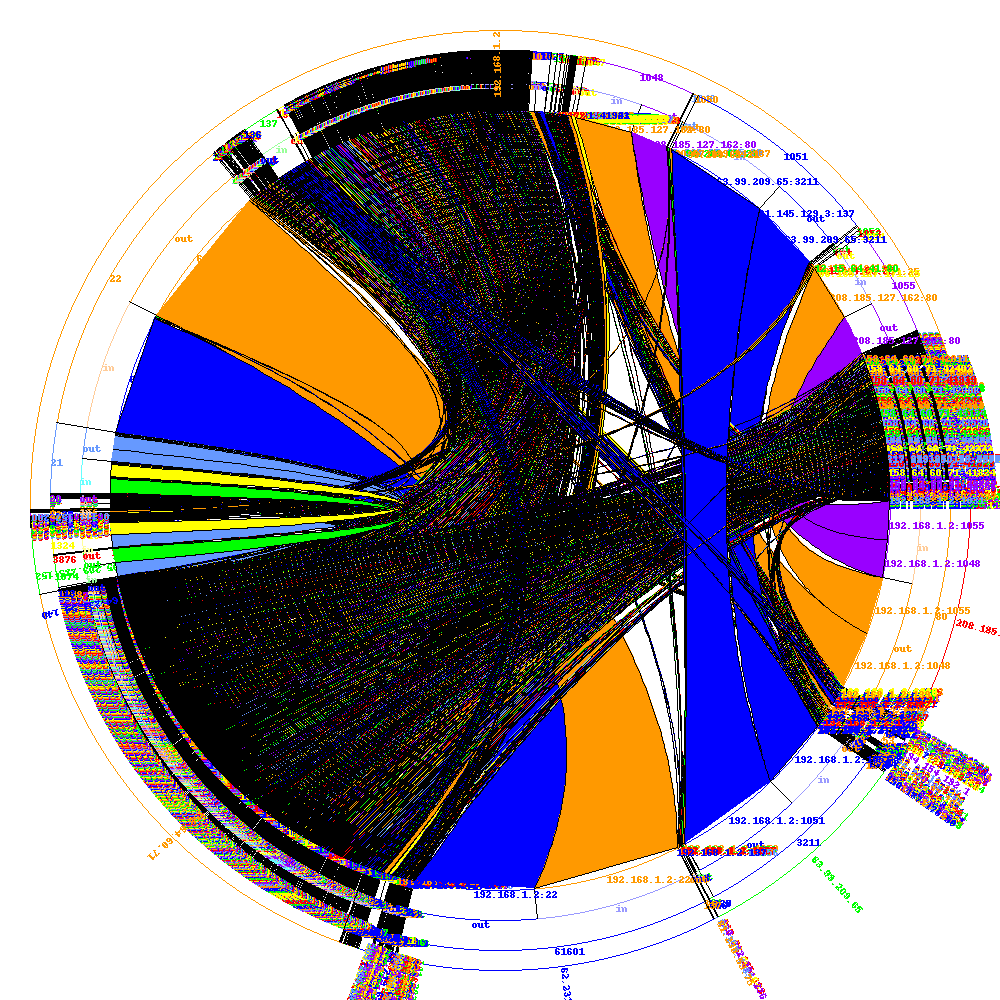

IP-Link Reloaded
================

The purpose of this new stuff is:

- to add to IP-Link a self-image generator;
- to test some new possibilities (link between communication port).

Currently, it is in alpha mode : scripts have only been tested on few files, there are things to improve.
But some results are interesting.

Bézier curve
------------

You have to use the scrips located in the folder: **./source/reloaded**.

SQLite DB Generation
~~~~~~~~~~~~~~~~~~~~

The first script takes a pcap file (from tcpdump -w), and creates a sqlite database, containing all communications information which are relevant (in our case, IPs ant ports).

Serialized object Generation
~~~~~~~~~~~~~~~~~~~~~~~~~~~~

The second script takes the database given by the first one, and creates a serialized object, with optionally some constraint.
For the moment, two filters have been implemented :

- limit to only communication between 2 IPs;
- limit number of communication to a number.

Image Generation
~~~~~~~~~~~~~~~~

The last scripts, with the serialized object from step 2, create a PNG image.
The script, based on the Python Imaging Library, contains some interesting algorithms :

- an self-made Circular Arc algorithm, because the one provided by the PIL does not support float angle;
- a Bezier Curves algorithm, from `this page <http://stackoverflow.com/questions/246525/how-can-i-draw-a-bezier-curve-using-pythons-pil>`_ ;
- a Text rotation algorithm.

.. image:: images/test15.png
   :align: center

Examples
~~~~~~~~

A basic one
^^^^^^^^^^^

.. code-block:: bash

    jerome@jerome-desktop:~/Bureau/pcapvisu-work$ ./pcap_to_sqlite.py -i ../capture.cap -o db.sqlite
    Creating table.
    Reading pcap and inserting values in the table...
    {17: 780, 6: 40356, 1: 555}
    jerome@jerome-desktop:~/Bureau/pcapvisu-work$ ./sqlite_to_object.py -i db.sqlite -o db.object
    DB connect
    Query sent to the base :
        SELECT ip_src, ip_dst, port_src, port_dst FROM ip_link
    Serialization...
    jerome@jerome-desktop:~/Bureau/pcapvisu-work$ ./object_to_image.py -i db.object -o image.png
    Loading objet...
    Generate Communication stats...
    Number of communication:  41691
    Number of IPs:  510
    Draw IP and Ports circles...
    Generate Port communication list...
    Draw Communication Links...

.. image:: images/image.png
   :align: center

Between 2 IPs
^^^^^^^^^^^^^

.. code-block:: bash

    jerome@jerome-desktop:~/Bureau/pcapvisu-work$ ./sqlite_to_object.py -i db.sqlite -o db.object -r ip -p 192.168.1.2:62.231.97.142
    DB connect
    Query sent to the base :
        SELECT ip_src, ip_dst, port_src, port_dst FROM ip_link WHERE (ip_src = "192.168.1.2" AND ip_dst = "62.231.97.142") OR (ip_src = "62.231.97.142" AND ip_dst = "192.168.1.2")
    Serialization...
    jerome@jerome-desktop:~/Bureau/pcapvisu-work$ ./object_to_image.py -i db.object -o image2.png
    Loading objet...
    Generate Communication stats...
    Number of communication:  5100
    Number of IPs:  2
    Draw IP and Ports circles...
    Generate Port communication list...
    Draw Communication Links...

.. image:: images/image2.png
   :align: center

With number limitation
^^^^^^^^^^^^^^^^^^^^^^

.. code-block:: bash

    jerome@jerome-desktop:~/Bureau/pcapvisu-work$ ./sqlite_to_object.py -i db.sqlite -o db.object -r number -p 1000
    DB connect
    Query sent to the base :
        SELECT ip_src, ip_dst, port_src, port_dst FROM ip_link LIMIT 10000
    Serialization...
    jerome@jerome-desktop:~/Bureau/pcapvisu-work$ ./object_to_image.py -i db.object -o image3.png
    Loading objet...
    Generate Communication stats...
    Number of communication:  10000
    Number of IPs:  273
    Draw IP and Ports circles...
    Generate Port communication list...
    Draw Communication Links...

A Ports-Scan
^^^^^^^^^^^^

.. code-block:: bash

    jerome@jerome-desktop:~/Bureau/pcapvisu-work$ ./pcap_to_sqlite.py -i test.cap -o dbtest.sqlite
    Creating table.
    Reading pcap and inserting values in the table...
    {1: 3, 6: 855, 17: 2}
    jerome@jerome-desktop:~/Bureau/pcapvisu-work$ ./sqlite_to_object.py -i dbtest.sqlite -o dbtest.object -r all
    DB connect
    Query sent to the base :
        SELECT ip_src, ip_dst, port_src, port_dst FROM ip_link
    Serialization...
    jerome@jerome-desktop:~/Bureau/pcapvisu-work$ ./object_to_image.py -i dbtest.object -o test.png
    Loading objet...
    Generate Communication stats...
    Number of communication:  857
    Number of IPs:  3
    Draw IP and Ports circles...
    Generate Port communication list...
    Draw Communication Links...

.. image:: images/test.png
   :align: center

Improvements
^^^^^^^^^^^^

The first two scripts are "ready to use", and their results can be the source of other analysis tool.
But the last, even if it gives some relatively good artistic picture, needs some improvements :

- improve the polygons drawing of link (on the contact with the circle). It's visible on the example "Between 2 IPs". For the moment, it's a simple line, linking the two Bezier Curves.
- improve label rotation and positioning. For the moment, only IP's label are rotated. The angle is correct, but the position of its box needs to be recalculated. **Done!**