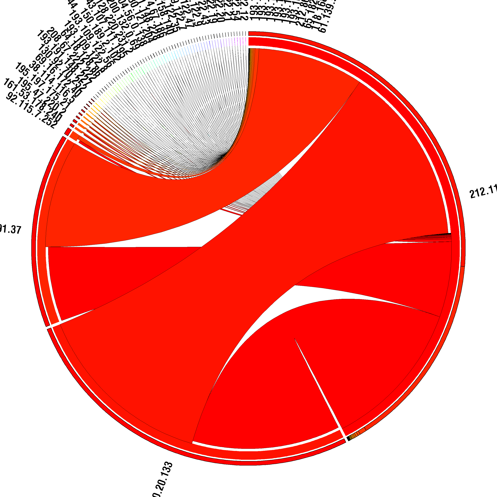

Unless stated otherwise, in all these examples we are considering that we start from the pcap file.

Circos graph
============

Circos install
--------------

Required perl module can be installed with:

.. code-block:: bash

    cpan -i module_name

You can download this example of Circos configuration.

Example
-------

.. code-block:: bash

    jerome@jerome-laptop:~/Desktop/visualisation/source$ python object_to_circos.py -i jub-dic.pyobj -o ip.circos
    Loading objet...
    Searching IP that are source and destination...
    Circos matrix generation...
    Saving the matrix...
    jerome@jerome-laptop:~/Desktop/circos-0.49/tools/tableviewer$ cat ../../../visualisation/source/ip.circos | ./bin/parse-table  | ./bin/make-conf -dir data
    jerome@jerome-laptop:~/Desktop/circos-0.49/tools/tableviewer$ ../../bin/circos -conf etc/circos.conf

The first command create matrix ip.circos of relation betwenn IPs, from serialized object jub-dic.pyobj.
The second use the tool provided with circos, tableviewer, to create circos data files from matrix.
The third one execute circos, with the data files generated, and create the graph.

Result

.. code-block:: bash

    ip    205.218.249.167    158.64.60.71    194.154.192.1    202.30.242.24    200.151.67.119    61.184.221.42    192.168.1.2    207.46.134.155    200.207.190.33
    205.218.249.167    -    0    0    0    0    0    1    0    0
    158.64.60.71    0    -    0    0    0    0    179    0    0
    194.154.192.1    0    0    -    0    0    0    5    0    0
    202.30.242.24    0    0    0    -    0    0    1    0    0
    200.151.67.119    0    0    0    0    -    0    1    0    0
    61.184.221.42    0    0    0    0    0    -    1    0    0
    192.168.1.2    1    174    5    1    1    1    -    9    1
    207.46.134.155    0    0    0    0    0    0    0    -    0
    200.207.190.33    0    0    0    0    0    0    1    0    -

.. image:: images/Circos2.png
   :align: center

Larger result, between 72 IPs :

.. image:: images/tableview.png
   :align: center

Larger result, between 100 IPs :

.. image:: images/Circos3.png
   :align: center

Bézier curve
============
