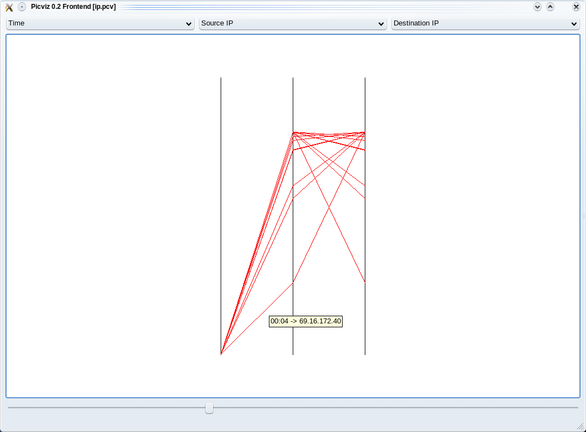

Unless stated otherwise, in all these examples we are considering that we start from the pcap file.

Circos graph
============

Circos install
--------------

Required perl module can be installed with:

.. code-block:: bash

    cpan -i module_name

You can download this example of Circos configuration.

Example
-------

.. code-block:: bash

    jerome@jerome-laptop:~/Desktop/visualisation/source$ python object_to_circos.py -i jub-dic.pyobj -o ip.circos
    Loading objet...
    Searching IP that are source and destination...
    Circos matrix generation...
    Saving the matrix...
    jerome@jerome-laptop:~/Desktop/circos-0.49/tools/tableviewer$ cat ../../../visualisation/source/ip.circos | ./bin/parse-table  | ./bin/make-conf -dir data
    jerome@jerome-laptop:~/Desktop/circos-0.49/tools/tableviewer$ ../../bin/circos -conf etc/circos.conf

The first command create matrix ip.circos of relation betwenn IPs, from serialized object jub-dic.pyobj.
The second use the tool provided with circos, tableviewer, to create circos data files from matrix.
The third one execute circos, with the data files generated, and create the graph.

Result

.. code-block:: bash

    ip    205.218.249.167    158.64.60.71    194.154.192.1    202.30.242.24    200.151.67.119    61.184.221.42    192.168.1.2    207.46.134.155    200.207.190.33
    205.218.249.167    -    0    0    0    0    0    1    0    0
    158.64.60.71    0    -    0    0    0    0    179    0    0
    194.154.192.1    0    0    -    0    0    0    5    0    0
    202.30.242.24    0    0    0    -    0    0    1    0    0
    200.151.67.119    0    0    0    0    -    0    1    0    0
    61.184.221.42    0    0    0    0    0    -    1    0    0
    192.168.1.2    1    174    5    1    1    1    -    9    1
    207.46.134.155    0    0    0    0    0    0    0    -    0
    200.207.190.33    0    0    0    0    0    0    1    0    -

.. image:: images/Circos2.png
   :align: center

Larger result, between 72 IPs :

.. image:: images/tableview.png
   :align: center
   :width: 50%

.. image:: images/tableview2.png
   :align: center
   :width: 50%

Larger result, between 100 IPs :

.. image:: images/Circos3.png
   :align: center

Bézier curve
============

More detais on `this page </bezier>`.

Scatter plot with ploticus
==========================

.. code-block:: bash

    cedric@debian:~/IP-Link/source$ python pcap_to_object1.py -i captures/capture.cap
    Reading pcap file...
    Serialization...
    
    cedric@debian:~/IP-Link/source$ python sqlite_to_object.py -r tts -p 1231950347:1231950547
    DB connect
    Query sent to the base :
            SELECT ip_src, ip_dst FROM ip_link WHERE tts >= 1231950347 AND tts <=  1231950547
    Creating object...
    Reading query result...
    Serialization...
    
    cedric@debian:~/IP-Link/source$ python object_to_scatterplot.py
    Loading dictionary...
    Creating categories file
    Creating ploticus data file
    Command to execute :
            ploticus -o ./scatterplot/scatterplot.png -png ./scatterplot/scatterplot -csmap -maxproclines
    Creating HTML map

Result

.. image:: images/scatterplot.png
   :align: center

GraphViz
========

.. code-block:: bash

    # create your capture
    root@debian:~/IP-Link/source$ tcpdump -p -i eth0 -s 0 -w captures/snif.pcap
    ^C1701 packets captured
    1701 packets received by filter
    0 packets dropped by kernel

    # create an object from the capture
    cedric@debian:~/IP-Link/source$ python pcap_to_object1.py -i captures/snif.pcap -o data/dic.pyobj
    Reading pcap file...
    Serialization...

    # create the GraphViz graph
    cedric@debian:~/IP-Link/source$ python object_to_graphviz.py -i ./data/dic.pyobj
    Loading dictionary...
    Creating GraphViz DOT file...
    Writting file.

The first command create a pcap. tcpdump captures all the network traffic on all interfaces and create captures/snif.pcap.
The second one parse the pcap and generate a serialized graph.
The last command create the DOT file from the saved serialized graph.

Now you can see the result by typing:

.. code-block:: bash

    dotty ./data/ip.dot

or :

.. code-block:: bash

    dot -Tpng -o graphviz.png ./data/ip.dot

Result

.. image:: images/ip.png
   :align: center
   :width: 80%

Picviz
======

.. code-block:: bash

    cedric@debian:~/IP-Link/source$ python pcap_to_sqlite1.py -qi captures/capture.cap -o data/ip.sql

    cedric@debian:~/IP-Link/source$ python sqlite_to_picviz.py -i data/ip.sql -r time -p 2009-1-16-00-03-00:2009-1-16-00-05-00
    DB connect
    Query sent to the base :
        SELECT tts, ip_src, ip_dst FROM ip_link WHERE tts >= 1232060580.0 AND tts <=  1232060700.0
    Creating Picviz file...
    Writting file...

With these otions sqlite_to_picviz.py extract the trafic between 2009/01/16 00h03m00s and 2009/01/16 00h05m00s. Then it creates the Picviz file.

Result

