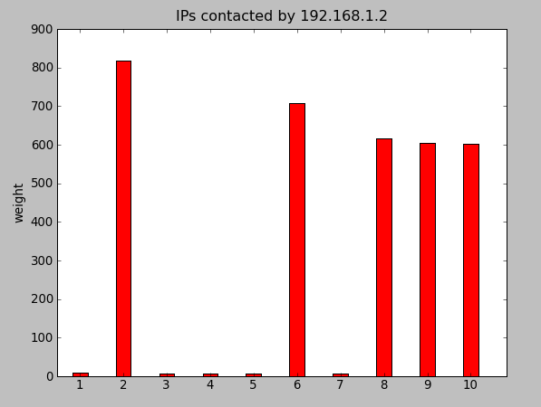

Circos circle
=============

Circos installation
-------------------

First, download the lastest version of `CIRCOS <http://www.circos.ca>`_ and the Circos tools (for the table viewer).
The required Perl module can be installed with:

.. code-block:: bash

    cpan -i module_name

You can download :download:`this example <_static/exemple-configuration-circos.tar.gz>` of Circos configuration.

Get a pcap file
---------------

.. code-block:: bash

    $ wget http://www.mediafire.com/file/gmmk388vkxcvme6/tbotpcaps.zip

    $ unzip tbotpcaps.zip 
    Archive:  tbotpcaps.zip
       creating: tbotpcaps/
      inflating: tbotpcaps/tbot_191B26BAFDF58397088C88A1B3BAC5A6.pcap  
      inflating: tbotpcaps/tbot_23AAB9C1C462F3FDFDDD98181E963230.pcap  
      inflating: tbotpcaps/tbot_2E1814CCCF0C3BB2CC32E0A0671C0891.pcap  
      inflating: tbotpcaps/tbot_5375FB5E867680FFB8E72D29DB9ABBD5.pcap  
      inflating: tbotpcaps/tbot_A0552D1BC1A4897141CFA56F75C04857.pcap  
      inflating: tbotpcaps/tbot_FC7C3E087789824F34A9309DA2388CE5.pcap

    $ cd tbotpcaps/

    $ mergecap -a *.pcap -w tbot.pcap

Alternatively, you can generate your own pcap:

.. code-block:: bash

    root@debian:~/IP-Link/source$ tcpdump -p -i eth0 -s 0 -w captures/snif.pcap

Generation of the input matrix for Circos
-----------------------------------------

.. code-block:: bash

    cedric@debian:~/ip-link/source$ ./pcap_to_object.py -i captures/tbot.pcap -o data/tbot.pyObj
    Reading pcap file...
    Serialization...

    cedric@debian:~/ip-link/source$ ./object_to_circos.py -i data/tbot.pyObj -o data/tbot.circos
    Loading objet...
    Searching IP that are source and destination...
    Circos matrix generation...
    Saving the matrix...

The first command generated a graph from the network capture.
The second one create the matrix *tbot.circos* of relation betwenn IPs,from serialized
object *tbot.pyObj*. Here is the :download:`generated matrix <_static/tbot.circos>`.
The matrix *tbot.circos* will be the input for the Circos table viewer.

Generation of the Circos circle
-------------------------------

.. code-block:: bash

    cedric@debian:~/circos-0.67-5$ cat tbot.circos | tools/tableviewer/bin/parse-table  | tools/tableviewer/bin/make-conf -dir data
    cedric@debian:~/circos-0.67-5$ ./bin/circos -conf circos.conf

The first command use the tool provided with Circos, tableviewer, to create Circos data files from matrix.
The second one execute Circos, with the data files generated, and create the graph.

Here is the generated Circos circle:

.. image:: _static/images/tBot-Circos.png
   :align: center

Bézier curve
============

More detais on :doc:`this page </bezier>`. This view enables to see the relations between ports.

Scatter plot with ploticus
==========================

.. code-block:: bash

    cedric@debian:~/IP-Link/source$ python pcap_to_object.py -i captures/capture.cap
    Reading pcap file...
    Serialization...

    cedric@debian:~/IP-Link/source$ python sqlite_to_object.py -r tts -p 1231950347:1231950547
    DB connect
    Query sent to the base :
            SELECT ip_src, ip_dst FROM ip_link WHERE tts >= 1231950347 AND tts <=  1231950547
    Creating object...
    Reading query result...
    Serialization...

    cedric@debian:~/IP-Link/source$ python object_to_scatterplot.py
    Loading dictionary...
    Creating categories file
    Creating ploticus data file
    Command to execute :
            ploticus -o ./scatterplot/scatterplot.png -png ./scatterplot/scatterplot -csmap -maxproclines
    Creating HTML map

Result

.. image:: _static/images/scatterplot.png
   :align: center

GraphViz
========

.. code-block:: bash

    # create your capture
    root@debian:~/IP-Link/source$ tcpdump -p -i eth0 -s 0 -w captures/snif.pcap
    ^C1701 packets captured
    1701 packets received by filter
    0 packets dropped by kernel

    # create an object from the capture
    cedric@debian:~/IP-Link/source$ python pcap_to_object.py -i captures/snif.pcap -o data/dic.pyobj
    Reading pcap file...
    Serialization...

    # create the GraphViz graph
    cedric@debian:~/IP-Link/source$ python object_to_graphviz.py -i ./data/dic.pyobj
    Loading dictionary...
    Creating GraphViz DOT file...
    Writting file.

The first command create a pcap. tcpdump captures all the network traffic on all interfaces and create captures/snif.pcap.
The second one parse the pcap and generate a serialized graph.
The last command create the DOT file from the saved serialized graph.

Now you can see the result by typing:

.. code-block:: bash

    dotty ./data/ip.dot

or :

.. code-block:: bash

    dot -Tpng -o graphviz.png ./data/ip.dot

Result

.. image:: _static/images/ip.png
   :align: center
   :width: 80%

Picviz
======

.. code-block:: bash

    cedric@debian:~/IP-Link/source$ python pcap_to_sqlite.py -qi captures/capture.cap -o data/ip.sql

    cedric@debian:~/IP-Link/source$ python sqlite_to_picviz.py -i data/ip.sql -r time -p 2009-1-16-00-03-00:2009-1-16-00-05-00
    DB connect
    Query sent to the base :
        SELECT tts, ip_src, ip_dst FROM ip_link WHERE tts >= 1232060580.0 AND tts <=  1232060700.0
    Creating Picviz file...
    Writting file...

With these otions sqlite_to_picviz.py extract the trafic between 2009/01/16 00h03m00s and 2009/01/16 00h05m00s. Then it creates the Picviz file.

Result

.. image:: _static/images/picviz1.png
   :align: center

RealTime Graph 3D
=================

.. code-block:: bash

    debian:/home/cedric/IP-Link/source# tcpdump -p -i eth0 -s 0 -w captures/snif.pcap
    tcpdump: listening on eth0, link-type EN10MB (Ethernet), capture size 65535 bytes
    ^C1549 packets captured
    1549 packets received by filter
    0 packets dropped by kernel
    debian:/home/cedric/IP-Link/source# exit
    exit

    cedric@debian:~/IP-Link/source$ python pcap_to_object.py -i captures/snif.pcap
    Reading pcap file...
    Serialization...

    cedric@debian:~/IP-Link/source$ python object_to_rtgraph.py

Result

.. image:: _static/images/rtgraph.png
   :align: center
   :width: 80%

MooWheel
========

.. code-block:: bash

    cedric@debian:~/IP-Link/source$ python pcap_to_sqlite.py -qi captures/capture.cap

    cedric@debian:~/IP-Link/source$ python sqlite_to_object.py
    DB connect
    Query sent to the base :
            SELECT ip_src, ip_dst FROM ip_link
    Creating object...
    Reading query result...
    Serialization...

    cedric@debian:~/IP-Link/source$ python object_to_moowheel.py
    Loading dictionary...
    Creating MooWheel file...
    Writting file.

Result

.. image:: _static/images/moowheel.png
   :align: center

Pointing your mouse over 212.110.251.3 will let you see that 5 IP are not contacted by 212.110.251.3.
If you want to see better, you can make a filter this way :

.. code-block:: bash

    cedric@debian:~/IP-Link/source$ python sqlite_to_object.py -r ip_src -p 212.110.251.3
    DB connect
    Query sent to the base :
            SELECT ip_src, ip_dst FROM ip_link WHERE ip_src = "212.110.251.3"
    Creating object...
    Reading query result...
    Serialization...

    cedric@debian:~/IP-Link/source$ python object_to_moowheel.py -q

Now, 82.0.72.48, 86.0.48.47, 125.211.214.144, 123.129.255.167 and 91.121.165.159 are missing. These IP are never contacted by 212.110.251.3.

Another output with a bit more IP: http://cedric.bonhomme.free.fr/ip-link/moowheel/moowheel1.html

Histogram
=========

.. code-block:: bash

    cedric@debian:~/IP-Link/source$ python pcap_to_object.py -i captures/capture.cap
    Reading pcap file...
    Serialization...

    cedric@debian:~/IP-Link/source$ python object_to_csv.py
    Loading dictionary...
    Writting CSV file...
    cedric@debian:~/IP-Link/source$ python csv_to_histogram.py -s 192.168.1.2

Result

Here, for the moment, the legend is not display because histograms are used with the HTML gallery.

Filter by date
==============

.. code-block:: bash

    cedric@debian:~/IP-Link/source$ python sqlite_to_object.py -i data/ip.sql -r time -p 2009-1-15-22-00-00:2009-1-16-02-00-00
    DB connect
    Request sent to the base :
        SELECT ip_src, ip_dst FROM ip_link WHERE tts >= 1232053200.0 AND tts <=  1232067600.0
    Creating object...
    Reading the result of the query...
    Serialization...

    cedric@debian:~/IP-Link/source$ python object_to_graphviz.py -q

    cedric@debian:~/IP-Link/source$ dot -Tpng data/ip.dot -o pic.png

Result

.. image:: _static/images/pic.png
   :align: center
   :width: 80%

The generated graph represent the trafic between 2009/01/15 22h00m00s and 2009/01/16 02h00m00s.